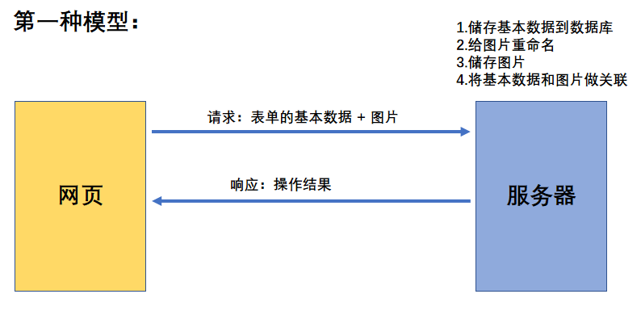
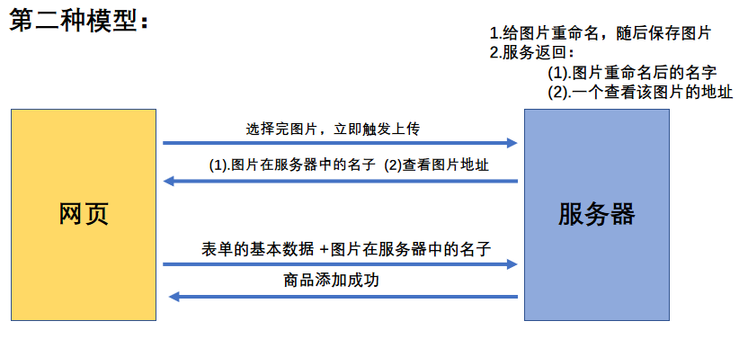

# 项目描述
- 此项目为一个前后台分离的后台管理的SPA应用, 包括前端PC应用和后端应用
- 包括用户管理 / 商品分类管理 / 商品管理 / 权限管理等功能模块
- 前端: 使用React全家桶/技术栈 + Antd + Axios + ES6+ + Webpack等技术
- 后端: 使用Node + Express + Mongodb等技术
- 采用模块化、组件化、工程化的模式开发

# 项目搭建步骤

## 使用脚手架
```
  npm install -g create-react-app
  create-react-app admin-client
  cd admin-client
  yarn start

  npm run build  // 打包
  npm install -g serve  // 安装静态资源
  serve build  // 运行打包后的项目
```

## 引入antd
具体配置请参考官方文档：https://ant.design/docs/react/use-with-create-react-app-cn

【注意点：】
在进行自定义主题时，要安装less-loader@5，并且移除 lessOptions 这一级，直接配置选项

`$ yarn add less less-loader@5`

```js
const { override, fixBabelImports, addLessLoader } = require('customize-cra');

module.exports = override(
  fixBabelImports('import', {
    libraryName: 'antd',
    libraryDirectory: 'es',
    style: true,
  }),
  addLessLoader({
    javascriptEnabled: true,
    modifyVars: { '@primary-color': '#1DA57A' },
  }),
);

```
## 引入路由
`yarn add react-router-dom`

1、在 pages 下创建 admin 、login 
2、给入口文件 index.js 中的 < App/> 包裹 **< BrowserRouter>** 
3、在 App.js 中映射路由
```js
  <Switch>
    <Route path='/login' component={Login}/>
    <Route path='/admin' component={Admin}/>
    <Redirect to='/login'/>
  </Switch>
```
## Login 组件

1、重置样式reset.css文件，可使用 github 上的 **minireset** 

2、react中使用img引入图片时候，要用import
```js
import logo from './images/sun.png'

```
3、引入 antd 中的 Form 组件进行表单验证

非自定义验证方式：
```js
rules={[
        { required: true, message: '请输入用户名!'},
        { max: 12, message: '必须小于等于12位!'},
        { min: 4, message: '必须大于等于4位!'},
        { pattern: /^\w+$/, message: '必须是英文、数字或下划线组成!'}
      ]}
```

自定义验证方式（一）：
```js
rules={[
        {validator:this.validate}
      ]}
-------------------------------------
// 每次只输入一个错误规则：
  validate = (_,value='') => {  //给value 一个默认空串，否则是undefined ,会报错
    if(!value.trim()){
      return Promise.reject('密码必须输入！')
    }
    if(value.length < 4){
      return Promise.reject('必须大于等于4位！')
    }
    if(value.length > 13){
      return Promise.reject('必须小于等于12位！')
    }
    if(!(/^\w+$/).test(value)){
      return Promise.reject('必须是英文、数字或下划线组成！')
    }
    else return Promise.resolve()
  }

```

自定义验证方式（二）：
```js
rules={[
        {validator:this.validate}
      ]}
-------------------------------------
//每次输入多个规则：
  validate = (_,value='') => {
    let errMsg = []
    if(!value.trim()) errMsg.push('密码必须输入！')
    if(value.length < 4) errMsg.push('必须大于等于4位！')
    if(value.length > 13) errMsg.push('必须小于等于12位！')
    if(!(/^\w+$/).test(value)) errMsg.push('必须是英文、数字或下划线组成！')
    if(errMsg.length !== 0) return Promise.reject(errMsg)
    else return Promise.resolve()
  }
```

## 封装 ajax 请求

`yarn add axios`

1、配置代理(服务器的端口是4000，本地的是3000)

在 package.json 文件中：
```js
"proxy": "http://localhost:4000" //将所有发送给3000的请求都发送给了4000
```
所以在发送 axios 请求时，不能向 4000 直接发请求了，要发送给 3000：
```js
onFinish = values => {
  axios.post('http://localhost:3000/login',values).then(
    response =>{console.log('成功了',response)},
    error =>{console.log('出错了',error)}
  )
};

```

2、post 请求体的3种格式

使用 axios 不用单独设置请求头，底层自动更改了请求头。

第一种：json

Content-Type: application/json
```js
import axios from 'axios'

let data = {"username":"admin","password":"admin"};
axios.post('http://localhost:3000/login',data)
.then(res=>{
    console.log('成功',res);            
})
```

第二种：urlencoded

Content-Type: application/x-www-form-urlencoded
```js
import axios from 'axios'
import qs from 'querystring'

let data = {"username":"admin","password":"admin"};
axios.post('http://localhost:3000/login',qs.stringify(
    data
)).then(res=>{
    console.log('成功',res);            
})
```

第三种：form

Content-Type: multipart/form-data

```js
import axios from 'axios'

let data = new FormData();
data.append('username','admin');
data.append('password','admin');
axios.post('http://localhost:3000/login',data)
.then(res=>{
    console.log('成功',res);            
})
```

3、二次封装 axios ：
- 配置请求的基础路径
- 配置超时时间
- 统一处理post请求json编码问题（转为urlencoded）
- 统一返回真正的数据data，而不是response对象
- 统一处理错误
- 进度条

## Login 组件

1.登录结果的提示+进度条

2.若登录成功，跳转到：/admin

```js
this.props.history.replace('/admin')
```

3.搭建项目的redux环境

4.登录成功后，保存用户信息到redux

```js
this.props.add_userInfo(data)
```

5.Admin组件读取用户名展示

```js
{this.props.username}

state => ({
    username:state.userInfo.user.username
  })
```
6.处理刷新页面,保存在redux中的用户信息丢失的问题——localStorage

```js
  actions:

  export const add_userInfo = userObj => {
  const {user,token} = userObj
  localStorage.setItem('user',JSON.stringify(user))
  localStorage.setItem('token',token)
  return {type : ADD_USERINFO , data : userObj}

  export const delete_userInfo = () =>{
  localStorage.clear()
  return {type : DELETE_USERINFO}
}
}
```
```js
reducers:

let _user;

try {
  _user = JSON.parse(localStorage.getItem('user'))
} catch (error) {
  _user = null
}

let _token = localStorage.getItem('token')

let initState = {
  user: _user || {} , 
  token: _token || '',
  isLogin : _user && _token ? true :false
}
```
7.给Login组件和Admin组件增加权限的校验

传递一个标识符：isLogin（当token 和 user 同时都有值的时候才算登录）

Login组件:如果已经登录，就直接跳转到 admin 组件中，并且停止渲染（render）整个login组件

```js
  render(){
    if(this.props.isLogin) return <Redirect to="/admin"/>
    return (
      ... ...
    )
  }
---------------------------------------------------------------
  state => ({
    username:state.userInfo.user.username,
    isLogin:state.userInfo.isLogin
  })

```
Admin组件:如果没有登录，就直接跳转到 login 组件中，并且停止渲染（render）整个 admin 组件

```js
  render(){
    if(!this.props.isLogin) return <Redirect to="/login"/>
    return (
      ... ...
    )
  }
  ---------------------------------------------------------------
  state => ({
    username:state.userInfo.user.username,
    isLogin:state.userInfo.isLogin
  })

```

8.Header组件-静态

9.Header组件-全屏，使用screenfull.js

`yarn add screenfull`

`import screenfull from 'screenfull'`

设置是否全屏 的state ———— 设置点击toggle事件 ———— 在生命周期componentDidMount中检测屏幕的变化，通过screenfull.onchange事件来设置setState全屏的状态

10.Header组件-退出登录

```js
this.props.delete_userInfo()
```

## 装饰器语法来定义容器组件

```js
@connect(
  state => ({}),
  {}
)

class Header extends Component {}

export default Header

```
## 使用高阶组件模仿路由守卫来定义页面访问的权限

```js
export default function (ReceiveComponent){
  @connect(
    state => ({
      isLogin:state.userInfo.isLogin
    })
  )

  class TargetComponent extends Component {
    render() {
      const {isLogin} = this.props
      const {pathname} = this.props.location
      if(!isLogin && pathname !== '/login') return <Redirect to="/login"/>
      if(isLogin && pathname === '/login') return <Redirect to="/admin"/>

      return <ReceiveComponent {...this.props}/>
    }
  }

  return TargetComponent
}
```
```js

@connect(
  state => ({}),
  {}
)

@Check

class Header extends Component {}

export default Header

```
## Header 组件

### 动态生成日期

`yarn add dayjs`

`import dayjs from 'dayjs'`

设置 时间 的state ———— 在生命周期componentDidMount中设置定时器每秒更改setState一下时间 ———— 在生命周期componentWillUnmount中清除定时器

### 动态生成天气
`yarn add jsonp` 利用 jsonp 来解决跨域问题

## LeftNav 组件

`npm view antd version` 查看所有版本

`yarn remove antd` 移除

### 二级路由
利用 递归 动态生成导航

### 在非路由组件中使用路由组件的API —— withRouter
```js
import {withRouter} from 'react-router-dom'

@withRouter
class LeftNav extends Component{}

export default LeftNav
```
### 解决刷新后，左侧导航默认选中项问题

让Menu的属性defaultSelectedKeys根据当前的路径动态展示
```js
let {pathname} = this.props.location
let currentName = pathname.split('/').slice(-1)
--------------------------------------------------------
<Menu
  defaultSelectedKeys={currentName}
  // defaultOpenKeys={['sub1']}
  mode="inline"
  theme="dark"
>
... ...
```
### 解决退出重新登录后，左侧导航没有默认选中问题
登录后，进入的路径是/admin,但是通过redirect更改了路径，而Menu的属性defaultSelectedKeys只能执行第一次，第二次更改的路径捕捉不到，因此，需要更换另一个属性SelectedKeys，该属性会使最后一次生效。


## Category 组件

### 内容区域较多时，可以设置一下内容，来生成滚动条：
```css
  min-height: 80%;
  overflow: auto;
```
### antd中如何获取input表单的value值：

情况一：`Form` 标签内置的`Button` 按钮上，自带的 `onFinish` 函数，参数就是`values` 对象；

用`onFinish` 函数提交表单验证时，系统自定义了验证规则

情况二：不使用`Form` 标签的`Button`提交表单，需要给`Form` 标签设置 `ref` 属性，通过 `this.refs.xxx`得到了`Form` 表单的实例，`this.refs.xxx.getFieldsValue().yyy` 得到的就是 `name = 'yyy'` 的那个 `Form.Item` 下的 `input` 的 `value` 值；

情况三：单独的input 标签，可以通过自身上的 onChange（event）函数属性 `onChange= {event => this.setState({keyWord:event.target.value})}`

提交表单验证时，需要手动验证数据的合法性，例如数据不能为空，否则不能提交表单

### antd中如何重置表单（清空表单的内容）

`this.refs.xxx.resetFields()`

### 修改分类的功能弹窗要把添加分类的弹窗 复用 ， 并做数据回显

antd表格的 columns 变量中的 render 函数的参数是所在项的详细信息，当同时指定 dataIndex 时，参数是 dataIndex 的值

antd中 input 标签当没有 Form 包裹时，它的 defaultValue 属性，只在初始时render一次 ； 当被Form 包裹时，它的 defaultValue 属性，会在初始时和Form重置(resetFields)时 render

在 input 标签中使用 defaultValue 属性会报错，应该在 Form 标签中加入 initialValues 属性，该属性是一个对象，属性名是 Form.Item 下的name 属性（initialValues 属性可以给各个 Form.Item 下的表单设置默认值）


--------------------------------------------------------------------------------------------
#### antd 做数据回显：

initialValues={{xxx: yyy}} ————负责初始时的数据回显

this.refs.xxx.setFieldsValue ————负责后续的数据回显

---------------------------------------------------------------------------------------------
#### 弹窗复用后如何区分是 添加功能 还是 修改功能？

- 添加功能 ：使用的是 Card 系统的 showModal 方法，参数是 event

- 修改功能 : showModal 方法放在了 render 下，参数是该行表格的数据的对象，有自定义的一些属性

判断参数，如果存在 自定义的属性 就执行修改功能，不存在就执行 添加功能；由于只要执行过一次修改，参数对象就永远带有这些自定义属性了，所以需要在判断开始时，对这些自定义属性进行初始化


## Product 组件

### 搜索商品列表的请求：

参数有三个，除了pageNum,pageSize ， 还有productName 、productDesc（按照名称或者描述搜索）二者任选其一

```js
export const reqSearchProList = (productType,keyWord,pageNum,pageSize) => ajax.get('/manage/product/list',{params:{[productType]:keyWord,pageNum,pageSize}})
```
#### 分页器的 onChange 事件，在切换页码时触发，参数时当前的页码，由于该事件不能动态指定，所以初始化显示列表以及搜索显示列表要写成一个函数，在此函数内部判断是初始化显示，还是搜索显示。

### 当表格数据没返回时，有loading效果
在state 中，设置 isLoading 状态，在请求数据前将 isLoading 设置为 false , 得到数据之后 将 isLoading 设置为 true ；并且在 Table 标签中设置 loading 属性 `loading ={this.state.isLoading}`


## Product 组件—— Detail组件

请求回来的数据 imgs 属性是一个数组（可能有多张图片），所以需要使用 map 函数遍历，return 一个 img 标签，所有的img 都有一个公共的地址，该地址定义在 config 文件中

#### imgs.map 会报错：cannot read property 'map' of undefined

这是因为 imgs ，是请求回来的数据，而发送请求的动作是在 DidMount 时，render 时还没有 DidMount，imgs 一瞬间是 undefined ，但马上有值，所以 imgs 是可以展示数据的，但是再 imgs 点属性 就没有值了

解决方法：在初始state给imgs=[]  或在 WillMount 中发请求（不常用）

`thisProductInfo:{imgs:[]}`

#### 返回的数据是 html 如何解析：
```js
const {detail} = this.state.thisProductInfo

<p dangerouslySetInnerHTML={{__html:detail}}/>
```

#### 请求商品列表的状态存在了redux中，可以先尝试从redux中读取列表，读取不到，就再次调用action重新获取

```js
if(this.props.categoryList.length === 0){
      this.props.get_categoryAsync()
    } 
```

## Product 组件—— AddUpdate组件

### 文件/图片上传





antd 封装的是第二种模式：

antd 需要借助 Upload 来发送 上传文件 的请求

```js
<Upload
  action="/api/manage/img/upload" //图片上传的接口路径
  name="image" // name是接口请求需要携带的参数名；参数值就是上传的那张图片，不用单独设置
  onChange={this.handleChange}
  ... ...
>
  ... ...
</Upload>

```
删除已上传的图片，需要自己写ajax
```js
handleChange = async ({ file,fileList }) => {
    if(file.status === 'done'){
      //response 是服务器返回的图片的名称和地址
      const {status,data} = file.response
      if(status === 0){
        Message.success('上传成功！')
        const {name,url} = data
        fileList[fileList.length-1].name = name
        fileList[fileList.length-1].url = url
      }
    }else if(file.status === 'remove'){
      const result = await reqDeletePic(file.name)
      const {status} = result
      if(status === 0) Message.success('删除成功！')
      else Message.error('删除失败！')
    }
    
    this.setState({ fileList })
  };

```


