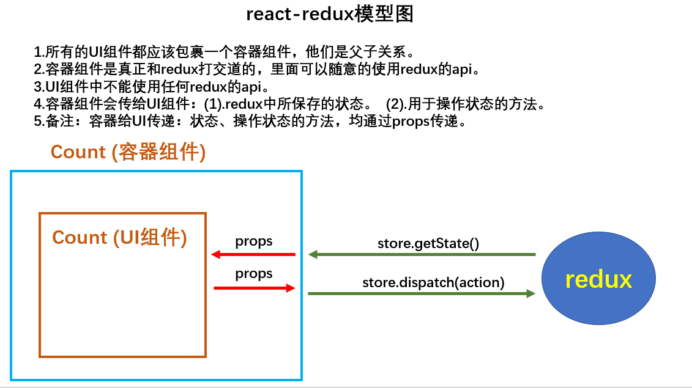

# Redux 


## mini版本redux (没有Action Creators)

`yarn add redux`

**基本步骤：**

1、建立redux文件夹，建立store.js，引入redux，创建一个store核心对象

- 如何得到store对象：
```js
import {createStore} from 'redux'
import reducer from './reducers'
const store = createStore(reducer)
```
- store对象的功能：
```js
getState(): 得到state
dispatch(action): 分发action, 触发reducer调用, 产生新的state
subscribe(listener): 注册监听, 当产生了新的state时, 自动调用
```
2、创建一个reducer.js（关键）
- reducer 是一个函数,该函数有两个参数，分别是：preState、action
- 该函数内部需要定义一个 newState ,并 return newState 
- action 有type 和 data 这两个属性，该函数内部需要根据不同的 type ，写不同的逻辑，得到 newState ，这个 newState 用于 return 出去
- 这个 reducer 函数需要 export default

3、store.js中引入reducer

4、组件中引入store，组件中不同的方法，可以调用拥有不同 type 的 dispatch ,dispatch 派发 action ,会找到该 store 对应的 reducer , reducer 中定义了这个 type 类型的 action 的逻辑
```js
store.dispatch({type:'increment',data:value*1}
store.getState()
```
5、在入口文件 index.js 中，监听状态的改变，并让页面的状态改变
```js
import store from './redux/store'

ReactDOM.render(<App/>,document.getElementById('root'))
//如果redux中保存的状态发生变化，那么就调用store.subcribe所指定的回调。
store.subscribe(()=>{
	ReactDOM.render(<App/>,document.getElementById('root'))
})
```

## 完整版本redux (有Action Creators)

**基本步骤：**

1、创建 actions/creator.js ，专门用于创建和 count 组件相关的 action , 并分别暴露
```js
export const createIncrementAction = value => ({type : 'increment' , data : value})
```
2、在 count 组件中，引入 actions/creator.js 中定义的 action
```js
import {createIncrementAction , createDecrementAction} from '../../redux/count_action_creator.js'

store.dispatch(createIncrementAction(value * 1))
```
3、优化：创建 action_type.js ,用于定义整个应用中的 action 对象中的 type 属性的常量,可以在使用这些变量的文件引入
```js
export const INCREMENT = 'increment'
```


# react-redux 


**react-redux将所有组件分成两大类:**

- UI组件

a.只负责 UI 的呈现，不带有任何业务逻辑

b.通过props接收数据(一般数据和函数)

c.不使用任何 Redux 的 API

d.一般保存在components文件夹下

- 容器组件

a.负责管理数据和业务逻辑，不负责UI的呈现

b.使用 Redux 的 API

c.一般保存在containers文件夹下

<hr>

**基本步骤：**

`yarn add react-redux`

- 建立containers文件夹，里面建立count.jsx（容器组件）
- 容器组件里引入 count.jsx(UI组件)，并在容器组件中定义传到UI组件的状态和方法
```
- 容器组件是真正和redux打交道的，里面可以随意的使用redux的api。
- 容器组件会传给UI组件：(1).redux中所保存的状态。 (2).用于操作状态的方法。
- 容器给UI传递：状态、操作状态的方法，均通过props传递，所以UI组件通过 this.props 获取传递过去的状态和方法。
- 容器组件，肯定是组件，但是容器组件不是你亲自去定义的，是靠connect方法生成的
```
**connect方法**

	1.connect()的返回值依然是一个函数。

	2.connect()(UI组件)的返回值是这个UI组件的容器组件。

	3.connect这样使用：connect(mapStateToProps，mapDispatchToProps)(UI组件)。

	4.mapStateToProps和mapDispatchToProps都是函数

	5.特别注意：mapDispatchToProps可以直接是一个对象。

	6.connect函数底层有判断，若第二个参数是对象，会加工成一个函数


**mapStateToProps方法**

	1、专门用于给UI组件传递redux中的状态，以props形式传递。

	2、因为 props是key-value的形式，所以mapStateToProps方法必须返回一个Object对象

	3、mapStateToProps方法所返回的那个对象的key就作为传给UI组件props的key

	4、mapStateToProps方法所返回的那个对象的value就作为传给UI组件props的value

**mapDispatchToProps方法**

1、专门用于给UI组件传递redux中的状态，以props形式传递。

2、因为props是key-value的形式，所以mapStateToProps方法必须返回一个Object对象

3、mapStateToProps方法所返回的那个对象的key就作为传给UI组件props的key

4、mapStateToProps方法所返回的那个对象的value就作为传给UI组件props的value


- App中渲染的不再是UI的Count了，而是容器的Count

- index.js中，要引入Provider，给Provider传递store
Provider的作用是给容器组件传递state和dispatch ,并且能够将变化渲染到页面
```js
import {Provider} from 'react-redux'

ReactDOM.render(
  <Provider store={store}>
    <App />
  </Provider>,
  document.getElementById('root')
)
```

- UI组件中用this.props.xxxx 得到状态、操作状态

# redux 异步编程 ———— redux-thunk

`yarn add redux-thunk`

**基本步骤**

- 在创建 store 时，应用中间件
```js
import {createStore , applyMiddleware} from 'redux'
import thunk from 'redux-thunk'

export default createStore(countReducer , applyMiddleware(thunk))
```
- 在 ActionCreator 中进行异步处理
```js
export const incrementAsync = value => {
  return (dispatch)=>{
    setTimeout(() => {
      dispatch(increment(value))
    }, 1000);
  }
}
```
- 在容器组件中定义异步的方法
```js
import {increment , decrement ,incrementAsync} from '../redux/actions/count.js'

export default connect(
  state =>({count:state}),
  {increment,decrement,incrementAsync}
)(Count)
```
- 在UI组件中接收容器组件传过来的方法
```js
this.props.incrementAsync(value)
```

## 多个组件应用redux

**基本步骤**

- 新建 reducers/index.js ,该文件是汇总一个一个的reducer，最终生成一个总的reducer

1.combineReducers是函数

2.combineReducers调用时要传入一个对象，这个对象就是redux中的总状态--state！！！

3.combineReducers的返回值是一个总reducer

```js
import countReducer from './count.js'
import personReducer from './count.js'
import {combineReducers} from 'redux'

export default combineReducers({
	count:countReducer,
	persons:personReducer
})
```

- 在 store.js 中引入总的 reducer

```js
import {createStore,applyMiddleware} from 'redux'
import allReducer from './reducers'
import thunk from 'redux-thunk'

export default createStore(allReducer,applyMiddleware(thunk))
```

- 在组件中得到state和action

```js
this.props.count
this.props.persons
```


